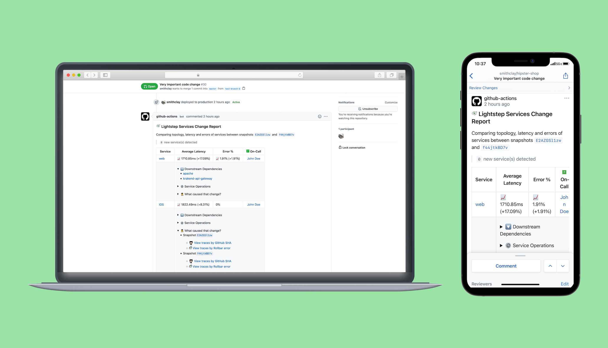

# Lightstep Services Change Report 

The `lightstep/lightstep-action-snapshot` action takes a [snapshot](https://lightstep.com/blog/snapshots-detailed-system-behavior-saved-shareable/) of a service in Lightstep and optionally attaches analysis of existing snapshot(s) to related pull requests or issues that helps developers understand how their production services change over time.

Snapshots help you correlate code changes in GitHub with latency and errors in different environments.



## Requirements

### Lightstep

  * Instrumented service(s) running in a production environment ([create account here](https://app.lightstep.com/signup))
  * Lightstep [API key](https://docs.lightstep.com/docs/create-and-manage-api-keys)

## Usage

This action can be run on `ubuntu-latest` GitHub Actions runner.

Taking a snapshot requires one step and no other dependencies:

```
    steps:  
      - name: Take Lightstep Snapshot
        id: lightstep-snapshot
        with:
          lightstep_api_key: ${{ secrets.LIGHTSTEP_API_KEY }}
          lightstep_organization: org
          lightstep_project: project
          # See https://api-docs.lightstep.com/reference#query-syntax
          # for supported queries.
          lightstep_snapshot_query: service IN ("frontend")
```

Most workflows will involve taking a snapshot *and* performing analysis on that snapshot, usually in the context of a GitHub PR or Issue. See examples below.

## Example Workfkows

* [Take a snapshot in response to an API trigger](./examples/workflows/snapshot.yml)
* [Take a snapshot after a deploy and get a report of what changed as a pull request comment](./examples/workflows/after_deploy.yml)
* [Take a snapshot when a specific label is applied to an issue](./examples/workflows/snapshot_to_issue.yml)

## Inputs

The following are **required** and can also be passed as environment variables:

| Action Input             | Env var                   |
| ------------------------ | ------------------------- |
| `lightstep_organization` | `LIGHTSTEP_ORGANIZATION`  |
| `lightstep_project`      | `LIGHTSTEP_PROJECT`       |
| `lightstep_service`      | `LIGHTSTEP_SERVICE`       |
| `lightstep_api_key`      | `LIGHTSTEP_API_KEY`       |

To take a snapshot, the following input is **required**:

| Action Input               | Description                                                                                                |
| -------------------------- | ---------------------------------------------------------------------------------------------------------- |
| `lightstep_snapshot_query` | [Query](https://api-docs.lightstep.com/reference#query-syntax) for what telemetry to collect in a snapshot |

To analyze a snapshot, the following input is **required**:

| Action Input               | Description                                                         |
| -------------------------- | ------------------------------------------------------------------- |
| `lightstep_snapshot_id`    | Existing snapshot id to analyze and add as a comment on an issue/PR |


The following are **optional**:

| Action Input                    | Description                                         |
| ------------------------------- | --------------------------------------------------- |
| `lightstep_snapshot_compare_id` | Snapshot to compare with `lightstep_snapshot_id` - if set to `*` will find the most recent snapshot  |
| `disable_comment`               | Prevents a comment from being added to an issue/PR  |

## Outputs

| Action Input             | Summary                            |
| ------------------------ | ---------------------------------- |
| `lightstep_snapshot_id`  | ID of the taken snapshot           |
| `lightstep_snapshot_md`  | Markdown analysis of the snapshot  |


## Using locally

This action can also be used with the [`act`](https://github.com/nektos/act) tool to run this action locally.

For example, this act with the example snapshot workflow in this repository to take a snapshot from a local environment:

```
  $ export LIGHTSTEP_API_KEY=your-api-key
  $ act deployment -s LIGHTSTEP_API_KEY=$LIGHTSTEP_API_KEY -W examples/workflows/snapshot.yml
```

## License

Apache License 2.0
